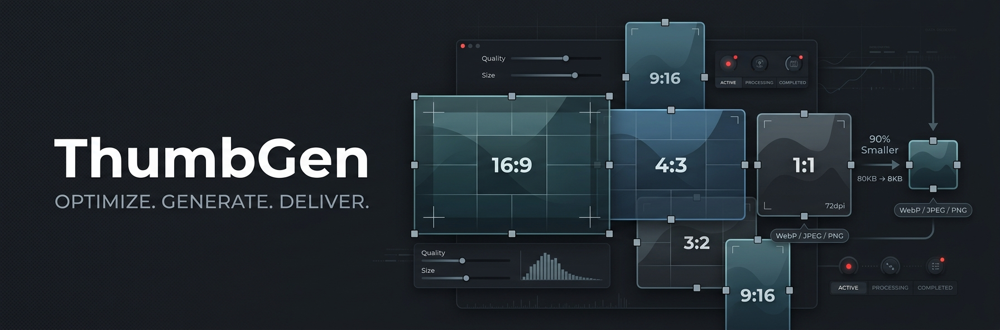

# ⚡ ThumbGen — Boutique Image Thumbnail Generator & Optimizer



> **ThumbGen** is a local-first, high-precision image thumbnail generator, cropper, and compressor. Combining slick industrial aesthetics with powerful web APIs, it allows content creators, designers, and developers to bulk-crop, resize, and compress image assets without ever uploading files to a remote server. Everything is processed entirely in your web browser.

---

## 🌟 Support the Project

If you love **ThumbGen** and find it useful, please consider supporting the project! Your encouragement keeps the development alive with new features, optimizations, and premium tooling.

### 💖 How You Can Help:
1. **Star the GitHub Repository:** Show your support by giving a ⭐ to the repository at [smammar100/Thumbgen](https://github.com/smammar100/Thumbgen).
2. **Spread the Word:** Share the project with friends, fellow creators, and developers!
3. **Contribute:** File issues, suggest new feature enhancements, or submit pull requests.

---

## 🚀 Key Features

- **🔒 Local-First & Private:** All cropping, resizing, and compressions are done directly on your local device. Your images are never transmitted to any third-party server, ensuring 100% data privacy.
- **🎨 Multi-Format Support:** Convert and exports images to:
  - **WebP:** Ultra-efficient compression scheme offering maximum bytes-saving without quality loss.
  - **JPEG:** Universally compatible, high-fidelity classic digital image encoding.
  - **PNG:** Lossless compression, ideal for transparency-preserving assets.
- **📏 Elite Aspect Ratios & Resizing:**
  - `1:1` (Perfect square for profile avatars, social platforms)
  - `16:9` (HD widescreen for YouTube, Vimeo, and modern displays)
  - `4:3` (Standard photography digital formatting)
  - `3:4` (Portrait orientation for mobile cards and feeds)
  - `40:21` (Optimized Open Graph crop preset for rich social preview links)
  - `Original` (Preserves exact input source dimensions)
- **🎯 Dynamic Anchor Grid:** Retain full control over visual priority! Align crops using a custom dot anchoring grid to lock focal interest (Center, Top-Left, Bottom-Right, etc.).
- **⚙️ Quality Compression Slider:** Fine-tune the optimization footprint from `0` to `100%` with real-time numeric readouts.
- **⚡ Batch Core Pipeline:** Drag & drop multiple files, inspect crops side-by-side in real-time, or remove selected queued items.
- **📦 ZIP Bulk Export:** Compile and zip all selected thumbnails instantly with structured naming controls into a single `.zip` file.
- **🌗 Responsive Dual Theme:** Pristine dark and light modes styled with high-contrast slate mechanical elements and rich fluid animations.

---

## 🛠️ Technology Stack

- **Framework:** [React 19](https://react.dev/) + [TypeScript](https://www.typescriptlang.org/) (Strictly typed architecture)
- **Build System:** [Vite](https://vite.dev/) for instant HMR and optimized asset packaging
- **Styling:** [Tailwind CSS v4](https://tailwindcss.com/) for high-fidelity layouts
- **Animations:** [Motion](https://motion.dev/) (Framer Motion v12) for smooth tactile UI loops
- **Icons:** [Phosphor Icons](https://phosphoricons.com/) for a sleek, cohesive icon design language
- **Zip Engine:** [JSZip](https://stuk.github.io/jszip/) for asynchronous browser-side archive generation

---

## 📦 Getting Started

### Prerequisites

Ensure you have [Node.js](https://nodejs.org/) (v18.x or later) and `npm` installed.

### Installation

1. Clone the repository:
   ```bash
   git clone https://github.com/smammar100/Thumbgen.git
   cd Thumbgen
   ```

2. Install dependencies:
   ```bash
   npm install
   ```

3. Launch the development server:
   ```bash
   npm run dev
   ```

4. Build for production:
   ```bash
   npm run build
   ```

---

## 🛡️ License

Distributed under the **Apache-2.0 License**. See `LICENSE` for more information.

---

<p align="center">
  Made with ♥ for creators and engineers. Remember to leave a ⭐ on <a href="https://github.com/smammar100/Thumbgen">ThumbGen GitHub</a>!
</p>
